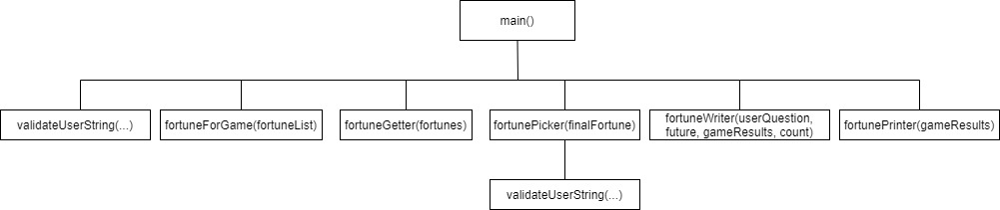
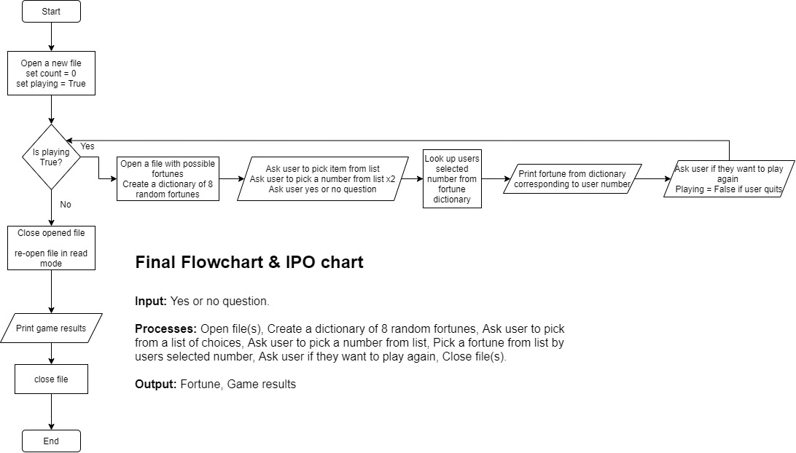

# Johnson-FinalProject

# Hierarchy Chart

# Flowchart and IPO

 
 
 

#Pseudocode
Create a new file in write mode for game results
Set the game count to 0
Create infinite loop while user is playing game
Increase count by 1 for each time game is run
Create an empty list
Open a file containing a list of fortunes
Append all fortunes into previously created list
Create an empty dictionary
Create a for loop to pull 8 random fortunes from list and add to dictionary
Set an "Odd number list"
Set an "Even number list"
Ask user to pick from list of choices
Prompt user to pick a number from even or odd list
Print numbers up to and including users picked number
Ask user to pick another number
Check number against dictionary and pull fortune from dictionary
Ask user for a yes or no question
Print users fortune from dictionary
Ask if user wants to play again
Play game again if users wishes
If user wishes to quit game write users question with count and fortune to file
Close the file from write mode
Re-open file from write mode
Display contents of file